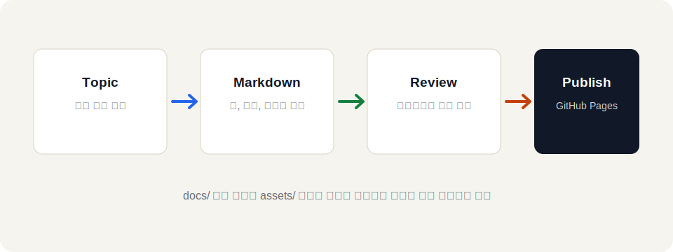

# 공부한 내용을 오래 남기는 기술 노트

GitHub, Vibe, Codex, Cloud 실습 내용을 주제별로 정리합니다. 명령어, 설정 파일, 실수했던 에러와 해결 과정을 다시 찾기 쉽게 모아둡니다.

[카테고리 보기](#categories) [문서 목록 보기](#문서-목록) [저장소 보기](https://github.com/brainshin/my-website)

## 문서 구성 예시

이 페이지는 앞으로 작성할 공부 기록의 메인 인덱스입니다. 아래처럼 표, 그림, 하위 문서 링크를 섞어서 실제 문서처럼 관리할 수 있습니다.

| 구분 | 목적 | 작성 예시 | 상태 |
| --- | --- | --- | --- |
| GitHub 가이드 | 저장소와 Pages 배포 흐름 정리 | 브랜치, commit, push, Pages 설정 | 작성 예정 |
| Vibe 가이드 | 아이디어를 빠르게 구현하는 흐름 정리 | 요구사항 정리, 화면 초안, 반복 수정 | 작성 예정 |
| Codex 가이드 | AI와 코드 작업하는 방식 정리 | 수정 요청, 검증, commit, push | 작성 중 |
| Terraform 가이드 | IaC 실습과 에러 해결 과정 정리 | variable, module, remote state, plan 에러 | 작성 예정 |

## 전체 흐름

아래 그림은 이 사이트에서 문서를 정리하는 기본 흐름입니다. 이미지는 `assets/diagrams/` 디렉터리에 따로 두고 Markdown에서 상대 경로로 불러옵니다.

## 문서 목록

- [GitHub Pages 배포 가이드](docs/github-pages-guide.md)
- [Codex 협업 가이드](docs/codex-workflow.md)
- [Terraform 에러 노트](docs/terraform-error-notes.md)

## Next Notes

- **GitHub Pages 배포 흐름**
  저장소, 브랜치, Pages 설정을 한 번에 정리합니다.

- **Vibe 작업 기록**
  아이디어를 코드로 옮길 때 사용한 패턴을 정리합니다.

- **Codex 협업 가이드**
  수정 요청, 검증, Git 반영 흐름을 정리합니다.

## Categories

### GitHub 가이드

Git 기본 명령어, 브랜치 전략, GitHub Pages 배포 과정을 정리합니다.

### 바이브 가이드

아이디어를 빠르게 만들고 다듬는 작업 방식과 프롬프트 흐름을 기록합니다.

### Codex 가이드

코드 수정 요청, 에러 분석, Terraform 검증처럼 반복되는 협업 패턴을 정리합니다.

### AWS 가이드

계정 전환, IAM, S3, EC2, 네트워크 구성에서 배운 내용을 모읍니다.

### Terraform 가이드

변수, remote state, module, plan 에러 해결 과정을 예제로 남깁니다.

### 에러 노트

실습 중 만난 에러 메시지와 실제로 해결한 명령어를 짧게 정리합니다.
